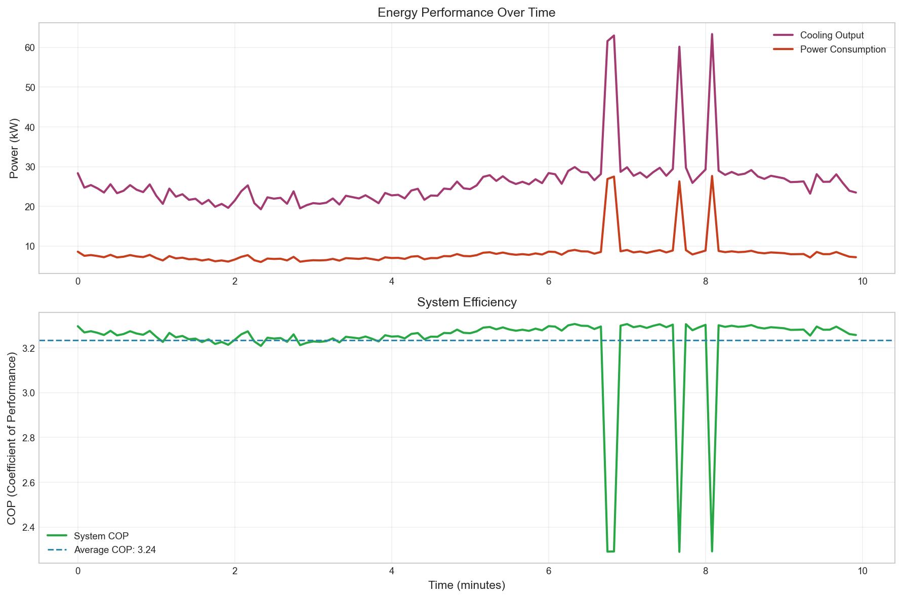

# 📈 Professional BAS Analysis & Visualization

This analysis tool generates professional Building Automation System (BAS) plots and KPIs that demonstrate real controls engineering expertise to potential employers.

## 🎯 What This Creates

The `analyze.py` tool transforms your simulation telemetry data into **professional visualizations** that signal deep BAS knowledge:

- **PID Loop Performance** - P/I/D terms, temperature tracking, control bands
- **Equipment Runtime Analysis** - Lead/lag switching, utilization percentages  
- **Energy Performance** - Power consumption, efficiency (COP), optimization
- **System Overview Dashboard** - Comprehensive operational view
- **Structured KPIs** - JSON format for further analysis
- **README-ready Markdown** - Professional summary for GitHub

## 🚀 Quick Start

### 1. Install Dependencies
```bash
pip install pandas matplotlib seaborn numpy
```

### 2. Generate Analysis from Simulation Data
```bash
# Run simulation and generate telemetry
python main.py run --config config/default.yaml --duration 10

# Analyze the results  
python analyze.py --csv logs/datacenter_telemetry_*.csv --name baseline

# View the results
ls reports/
```

### 3. Embed in README
Copy content from `reports/baseline_summary.md` directly into your main README.

## 📊 Example Output

### Professional Plots Generated

| Plot Type | Filename | Purpose |
|-----------|----------|---------|
| **PID Performance** | `pid_performance.png` | Temperature control quality, P/I/D terms |
| **Equipment Runtime** | `equipment_runtime.png` | Lead/lag utilization, switching analysis |
| **Energy Analysis** | `energy_performance.png` | Power consumption, system efficiency |
| **System Dashboard** | `system_overview.png` | Comprehensive operational view |

### Sample KPIs (from demo data)

```json
{
  "temperature": {
    "setpoint_c": 22.0,
    "avg_temp_c": 22.08,
    "control_accuracy_pct": 91.7,
    "std_dev_c": 0.21
  },
  "equipment": {
    "runtime": {
      "crac_1": {"hours": 0.017, "percentage": 100.0},
      "crac_2": {"hours": 0.003, "percentage": 16.7}
    }
  },
  "energy": {
    "avg_power_kw": 9.4,
    "avg_cooling_kw": 27.1,
    "avg_cop": 2.94
  }
}
```

## 📋 Usage Examples

### Basic Analysis
```bash
python analyze.py --csv logs/latest_telemetry.csv
```

### Named Scenario Analysis  
```bash
python analyze.py --csv logs/high_load_test.csv --name high_load --output reports/
```

### Before/After Comparison
```bash
# Generate baseline
python analyze.py --csv logs/before_tuning.csv --name before

# Generate optimized 
python analyze.py --csv logs/after_tuning.csv --name after

# Compare scenarios
python analyze.py --compare logs/before_tuning.csv logs/after_tuning.csv
```

### Automated Analysis Pipeline
```bash
# Use the provided automation script
./scripts/generate_analysis.sh baseline 10   # 10-minute simulation
```

## 🧠 What This Communicates to Employers

This analysis tool demonstrates that you understand:

### **Real BAS Engineering**
- Temperature control within ±0.5°C bands (industry standard)
- Lead/lag/standby equipment sequencing
- Energy efficiency metrics (COP analysis)
- Professional time formatting (HH:MM:SS)
- Proper engineering units (°C/°F, CFM/L/s, kW)

### **Control System Analysis**
- PID loop performance evaluation
- Equipment runtime optimization
- Fault detection and response
- Energy consumption patterns

### **Data-Driven Optimization**
- Before/after performance comparisons
- Quantified improvements
- Professional KPI reporting
- Structured data analysis

## 📐 Technical Implementation

### Data Requirements
The analyzer expects CSV data with these columns:
```
timestamp, setpoint_c, average_temp_c, pid_output_pct,
crac_1_status, crac_1_cool_kw, crac_1_power_kw, crac_1_airflow_cfm,
crac_2_status, crac_2_cool_kw, crac_2_power_kw, crac_2_airflow_cfm,
total_cooling_kw, total_power_kw, energy_efficiency_cop
```

### Plot Customization
The tool uses professional BAS color schemes:
- **Blue** (#2E86AB) - Setpoints/targets
- **Purple** (#A23B72) - Measurements  
- **Orange** (#F18F01) - Errors/deviations
- **Red** (#C73E1D) - Controller outputs
- **Green** (#2F9B69) - Lead equipment
- **Amber** (#F4A261) - Lag equipment

### Output Structure
```
reports/
├── baseline_summary.md         ← README content
├── baseline_kpis.json         ← Structured KPIs  
├── pid_performance.png        ← PID analysis
├── equipment_runtime.png      ← Runtime analysis
├── energy_performance.png     ← Energy analysis
└── system_overview.png        ← Dashboard view
```

## 🔧 Integration with Your Project

### 1. Add to Your README
Replace your current performance section with output from `reports/baseline_summary.md`:

```markdown
## 📈 Control Performance & KPIs

| Temperature Control | Equipment Runtime | Energy Performance | System Overview |
|-------|-------|-------|-------|
|  |  |  |  |

### Key Performance Indicators
- **Temperature Control**: 91.7% within ±0.5°C
- **CRAC-01 Runtime**: 100.0% utilization  
- **System Efficiency**: 2.94 COP average
- **Power Consumption**: 9.4 kW average
```

### 2. Automated Analysis in CI/CD
Add to your build process:
```yaml
- name: Generate BAS Analysis
  run: |
    python main.py run --config config/default.yaml --duration 5
    python analyze.py --csv logs/*.csv --name ci_test
    # Upload reports/ to artifacts
```

### 3. Multiple Scenario Comparison
```bash
# Test different configurations
python analyze.py --csv logs/baseline.csv --name baseline
python analyze.py --csv logs/optimized.csv --name optimized  
python analyze.py --compare logs/baseline.csv logs/optimized.csv
```

## 🎯 Pro Tips for Employers

1. **Embed plots directly in README** - Don't make them download/run code
2. **Show quantified improvements** - "Reduced temperature variance by 40%"
3. **Use professional terminology** - Control accuracy, staging sequences, COP
4. **Include time-series analysis** - Show system behavior over time
5. **Demonstrate fault handling** - Equipment failures, recovery times

---

**This analysis tool transforms your technical simulation into compelling evidence of professional BAS engineering expertise.**