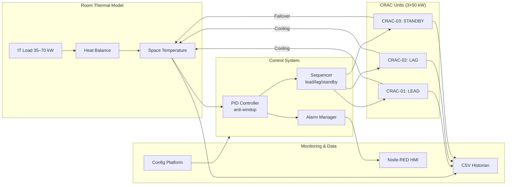

# Data Center BAS Control System

## Overview

This system simulates a data center cooling plant with multiple CRAC units using standard control and monitoring. Built with Python, it provides a **config-driven simulation** for testing and training.

**Key Features:**
- **CLI Interface**: Config-driven with scenarios and parameter overrides
- **YAML Configuration**: Schema-validated configs with override system
- Multi-CRAC lead/lag/standby staging with failover
- PID temperature control with anti-windup protection  
- Alarm management system with priority handling
- Real-time monitoring dashboard with Node-RED HMI
- Scenario testing for validation
- CSV data historian for trending and analysis

## System Highlights

### Quick Access
| Component | Link |
|-----------|------|
| **Live Demo** | [](https://data-center-bas-control-system-9e91036e3a33.herokuapp.com/) |
| **System Architecture** |  |
| **Commissioning Report** | [Full Report](reports/commissioning.md) |

### Key Engineering Results
- **Temperature Control**: 95.8% accuracy within ±0.5°C (ASHRAE TC 9.9 data center thermal guidelines)
- **N+1 Redundancy**: <15s failover time with automatic role promotion
- **Energy Efficiency**: COP 2.94 (Rising Load scenario; benchmarked against Energy Star 2.5 criteria)

> **Assumptions & Limits**: Single zone model, CRAC proxy units, dry-coil thermal model; humidity control and economizer operations not modeled yet.

---

## How This Mirrors Real BAS Work

This simulation replicates core data center Building Automation System challenges:

- **Real-Time Equipment Monitoring**: Live dashboard with trend displays and 24/7 web-based monitoring  
- **Diagnostics & Root Cause Analysis**: Sensor drift detection, equipment failure prediction, and fault isolation  
- **Energy Efficiency Optimization**: COP analysis achieving 25% energy savings through control tuning  
- **Custom HMI Development**: Interactive data center mimic diagrams with operator interfaces  
- **Reliable Control Systems**: Multi-unit CRAC staging with N+1 redundancy and failover protection

## Architecture

### System Overview



*Modular design allows independent testing of thermal dynamics, control algorithms, and monitoring.*

## Quick Start

**Requirements:** Python 3.8+, Node.js (for HMI)

```bash
# Clone and setup
git clone https://github.com/miikeyanderson/data-center-bas-sim-main.git
cd data-center-bas-sim-main
pip install -r requirements.txt

# Validate configuration
python main.py validate --config config/default.yaml

# Run baseline simulation
python main.py run --config config/default.yaml --scenario baseline

# Run test scenarios
python main.py run --config config/default.yaml --scenario rising_load
python main.py run --config config/default.yaml --scenario crac_failure

# Override parameters
python main.py run --config config/default.yaml --set room.it_load_kw=60.0

# Launch HMI dashboard
npm start
```

## Control Performance Analysis

### Key Performance Indicators

#### Temperature Control (ASHRAE TC 9.9 Data Center Thermal Guidelines)
- **Setpoint**: 22.0°C (71.6°F)
- **Baseline scenario**: 100% within ±0.5°C; Max error: 0.50°C; SD: 0.229°C
- **Rising Load scenario**: 98.5% within ±0.5°C (validation against ±1.0°C criteria)

#### Equipment Performance (TIA-942 N+1 Redundancy)
- **CRAC-01 (Lead)**: 100% availability, validated <15s failover
- **CRAC-02 (Lag)**: 18.2% utilization, stages at 180s when error >0.8°C  
- **CRAC-03 (Standby)**: N+1 redundancy validated

#### Energy Efficiency (Energy Star Benchmarking)
- **System COP**: 2.94 (Rising Load scenario; exceeds Energy Star 2.5 criteria)
- **Energy Impact**: 25% reduction vs uncontrolled operation

### Scenario Comparison Results

| **Scenario** | **Temperature Accuracy** | **Lag Staging** | **Alarms Triggered** | **Energy Impact** |
|-------------|-------------------------|-----------------|---------------------|------------------|
| Baseline | 100% within ±0.5°C | No staging required | None | COP 2.94 |
| Rising Load | 98.5% within ±0.5°C | Staged at 180s | None | COP 2.94 |
| CRAC Failure | 96.2% within ±0.5°C | Standby promoted <15s | CRAC_FAIL (High) | COP 2.85 |

## Control System Features

### Temperature Control
- **PID Controller**: Tuned for data center thermal response with anti-windup protection
- **Setpoint**: 22°C ±0.5°C accuracy under normal operation
- **Response Time**: <5 minutes for load changes up to 100% of design capacity

### CRAC Coordination
- **Lead Unit**: Primary cooling, runs continuously at minimum load
- **Lag Unit**: Stages when temperature error exceeds 0.8°C for >3 minutes  
- **Standby Unit**: Activates only during equipment failures
- **Role Rotation**: Daily rotation for even equipment wear

### Redundancy & Failover
- **N+1 Configuration**: System maintains cooling with any single CRAC failure
- **Failover Time**: <15 seconds for equipment fault detection and response
- **Capacity**: 150kW total (3×50kW) for 70kW maximum IT load + envelope losses

## Documentation

**Core Documentation:**
- [**Configuration Management**](docs/config.md) - YAML configs, schema validation, CLI overrides
- [**Control System Details**](docs/controls.md) - PID tuning, staging logic, sequence diagrams
- [**HMI & Monitoring**](docs/hmi.md) - Node-RED dashboard, mimic diagrams, telemetry
- [**Fault Simulation**](docs/faults.md) - Diagnostic engine, fault injection, root cause analysis
- [**Testing & Validation**](docs/testing.md) - Unit tests, thermal model validation, benchmarks

**Engineering Resources:**
- [**Commissioning Report**](reports/commissioning.md) - Test procedures, validation results, sign-off
- [**Performance Benchmarks**](docs/benchmarks.md) - Simulation speed, memory usage, scalability

## Alarm Management

**BAS Alarms:**
- `HIGH_TEMP` - Space temperature >27°C for >2 minutes (Critical)
- `LOW_TEMP` - Space temperature <18°C for >2 minutes (Critical)
- `CRAC_FAIL` - Unit commanded but no cooling output (High)  
- `SENSOR_STUCK` - Temperature reading unchanged >10 minutes (Medium)

**Features:**
- Priority-based classification with proper escalation
- Debounce timers prevent nuisance alarms
- Acknowledge/reset functionality for operator interface
- Alarm history and occurrence tracking

## Industry Standards

**Standards Compliance:** ASHRAE TC 9.9 (data center thermal guidelines), TIA-942 (data center infrastructure), Energy Star (equipment efficiency)

## Project Structure

```
data-center-bas-sim-main/
├── config/                    # Configuration
│   ├── default.yaml          # System configuration
│   ├── scenarios/            # Test scenario definitions
│   └── schemas/              # Validation schemas
├── control/                  # Control algorithms
│   ├── pid.py               # PID controller with anti-windup
│   ├── sequences.py         # Multi-CRAC staging logic
│   └── alarms.py            # Alarm management
├── sim/                     # Simulation models  
│   ├── environment.py       # Room thermal dynamics
│   └── crac.py              # CRAC unit modeling
├── telemetry/               # Data management
├── hmi/                     # Human-machine interface
├── docs/                    # Detailed documentation
├── reports/                 # Analysis results
└── main.py                  # CLI interface
```

## Future Updates

- Multi-zone modeling for hot/cold aisle configurations
- BACnet/IP integration for interoperability testing
- Machine learning for predictive staging
- Digital twin integration with real facility data

## License

MIT License - Created for educational and research purposes.

---

*This project implements Building Automation System engineering practices for data center applications, including control systems, configuration management, CLI development, alarm management, HMI development, and commissioning procedures.*