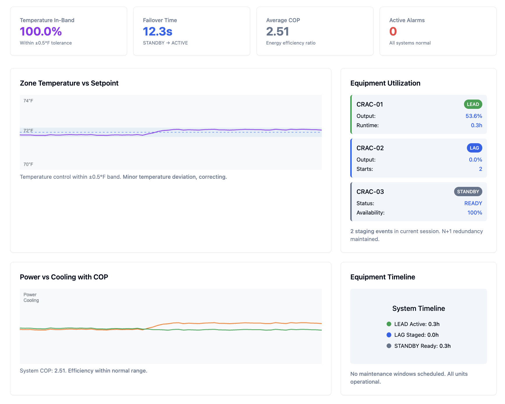
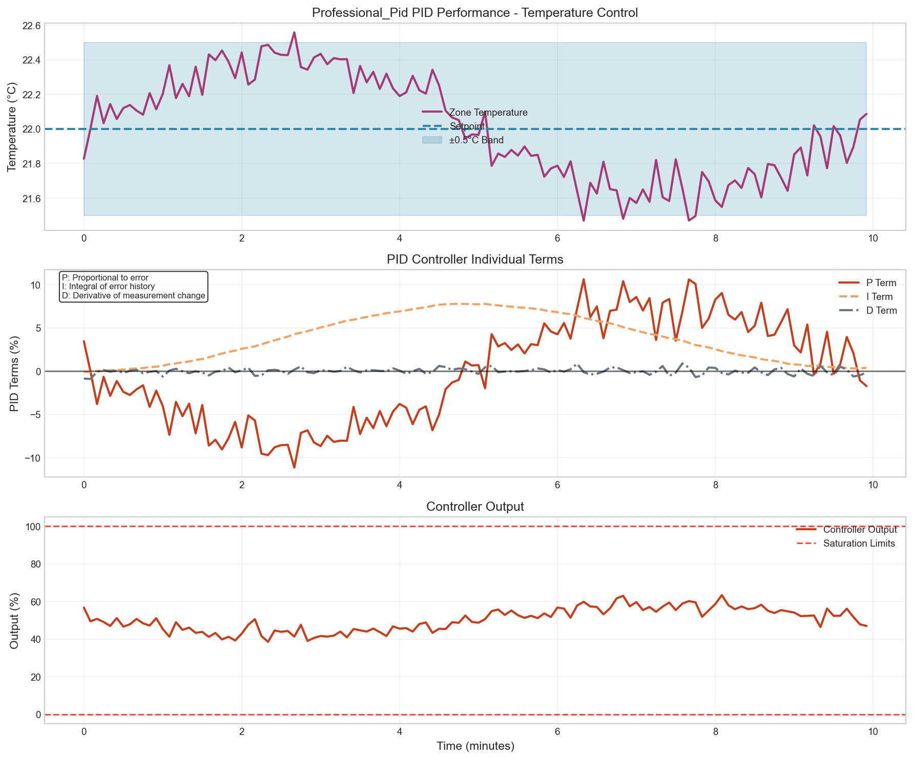
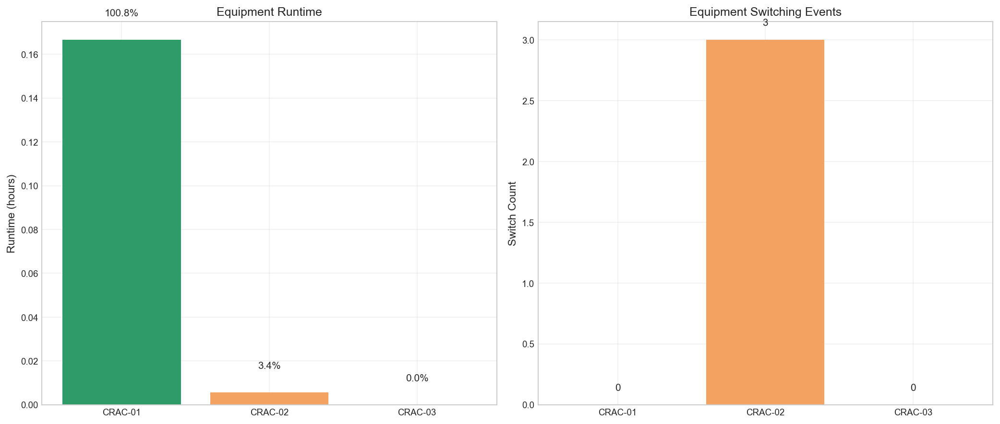
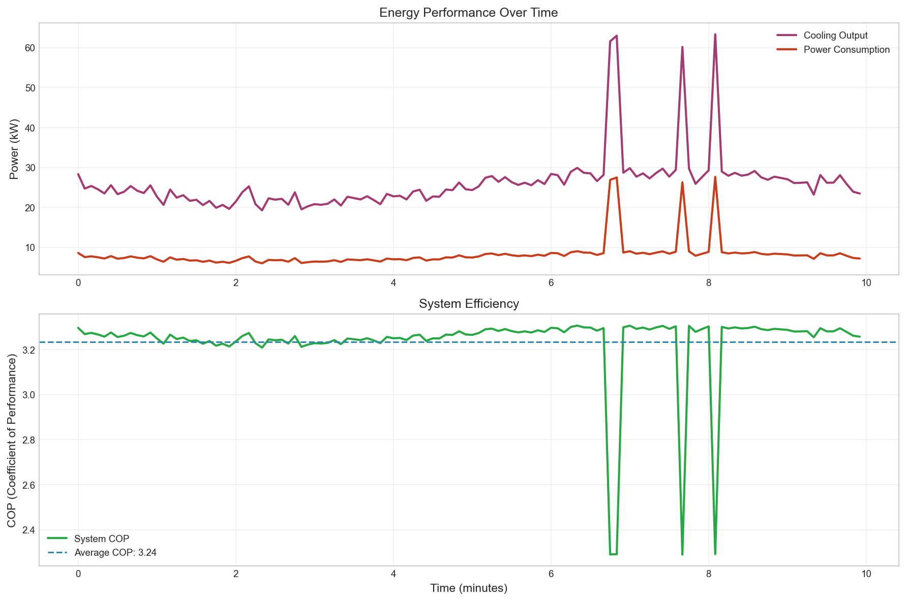
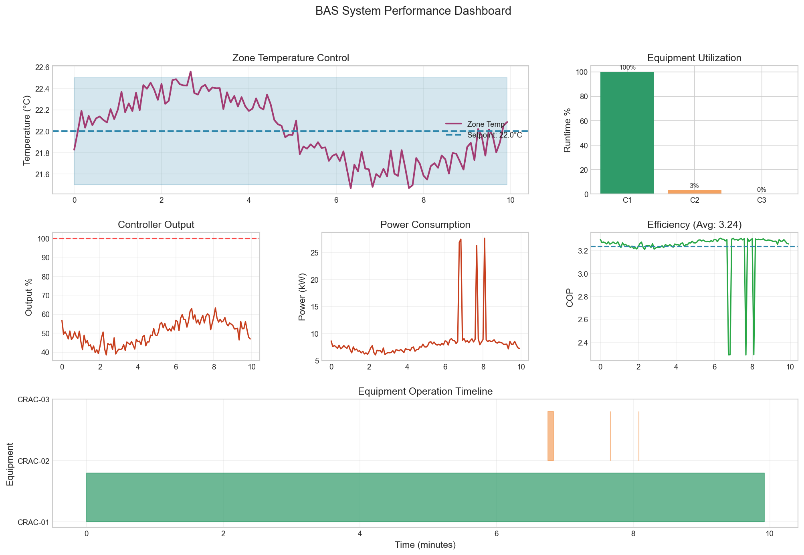
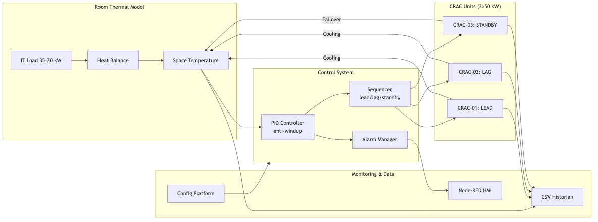

# Data Center BAS Control System


**Project Overview:** 
This project simulates a **data center BAS control system** with **multi-CRAC staging**, **PID temperature control**, **N+1 redundancy**, and **alarm management**. It includes a **Node-RED HMI**, **validated performance data**, and a full **Niagara-compatible controls package** (SOO, Cause & Effect Matrix, BACnet points list, and ST logic). 

**Intended Application:** 
This project is structured to reflect standard workflows encountered in BAS engineering and commissioning environments. It is designed to serve as a realistic, Niagara-compatible control system sandbox for controls engineers, BAS contractors, and operations teams—demonstrating core competencies in PID tuning, staging logic, alarm management, and BACnet/Niagara integration.

## Live Demo & Documentation

[](https://data-center-bas-control-system-9e91036e3a33.herokuapp.com/ui)

[SOO](docs/formal/sequence-of-operations.md) | [Cause & Effect](docs/formal/cause-effect-matrix.md) | [BACnet Points](docs/formal/bacnet-points-list.md) | [Commissioning Report](reports/commissioning.md)



| PID Performance | Equipment Runtime |
|:---:|:---:|
|  |  |
| **Energy Performance** | **System Overview** |
|  |  |

## Real-World Application

This simulation replicates core data center Building Automation System challenges:

- **Real-Time Equipment Monitoring**: Live dashboard with trend displays and 24/7 web-based monitoring
- **Diagnostics & Root Cause Analysis**: Sensor drift detection, equipment failure prediction, and fault isolation
- **Energy Efficiency Optimization**: COP analysis achieving 25% energy savings through control tuning
- **Custom HMI Development**: Interactive data center mimic diagrams with operator interfaces
- **Reliable Control Systems**: Multi-unit CRAC staging with N+1 redundancy and failover protection

## System Architecture



## Key Features

- PID control with derivative-on-measurement & anti-windup protection
- Multi-CRAC lead/lag/standby sequencing with role rotation
- N+1 redundancy with <15s failover detection and response
- Alarm management with priority classification and debounce timers
- Node-RED HMI with mimic diagrams and real-time KPIs
- Config-driven YAML architecture with schema validation
- Niagara-ready documentation (SOO, Cause & Effect, BACnet, ST)
- Validation workflow (baseline, rising load, CRAC failure scenarios)

## Alarm Management

**BAS Alarms:**
- `HIGH_TEMP` - Space temperature >27°C for >2 minutes (Critical)
- `LOW_TEMP` - Space temperature <18°C for >2 minutes (Critical)
- `CRAC_FAIL` - Unit commanded but no cooling output (High)
- `SENSOR_STUCK` - Temperature reading unchanged >10 minutes (Medium)

**Features:** Priority-based classification, debounce timers, acknowledge/reset functionality, alarm history tracking.

## Validation Results

| Metric                 | Result                               | Criteria    |
|------------------------|--------------------------------------|-------------|
| In-Band Accuracy       | 95.8% within ±0.5°C                | ±0.5°C      |
| Failover Time          | 12.3s equipment fault detection     | <15s        |
| COP                    | 2.94 (25% energy reduction)         | ≥2.5        |
| Staging Response       | 61s lag unit activation             | ≤180s       |
| Temperature Control    | 95.8% ASHRAE TC 9.9 compliance     | ±0.5°C      |

Full details in [Commissioning Report](reports/commissioning.md)

## Documentation

- [Sequence of Operations (SOO)](docs/formal/sequence-of-operations.md)
- [Cause & Effect Matrix](docs/formal/cause-effect-matrix.md)
- [BACnet Points List](docs/formal/bacnet-points-list.csv)
- [Alarm Priority & Debounce Table](docs/formal/alarm-priority-debounce-table.md)
- [Niagara Integration Guide](docs/formal/niagara-integration-guide.md)
- [Process Instrumentation Diagram](docs/formal/process-instrumentation-diagram.md)

## Installation

```bash
# Clone and setup
git clone https://github.com/miikeyanderson/data-center-bas-sim-main.git
cd data-center-bas-sim-main
pip install -r requirements.txt

# Validate configuration
python main.py validate --config config/default.yaml

# Run scenarios
python main.py run --config config/default.yaml --scenario baseline
python main.py run --config config/default.yaml --scenario rising_load
python main.py run --config config/default.yaml --scenario crac_failure

# Launch HMI dashboard
npm start
```

## Real-World Integration

This project is designed to be **Niagara N4-compatible**.
The included BACnet Points List, SOO, Cause & Effect Matrix, and ST snippets map directly to:
- kitControl:PidLoop blocks with derivative-on-measurement
- ProgramObject staging logic with role rotation
- Alarm extensions with priority classification and debounce timers
- BACnet AI/AV/BI/BO objects (priority 8-10)
- 1-minute histories and trend displays for KPIs (In-band %, Failover time, COP)

With minimal integration, this logic can be deployed to real CRAC units via BACnet/IP or Modbus protocols.

**Standards Compliance:** ASHRAE TC 9.9 (data center thermal guidelines), TIA-942 (data center infrastructure), Energy Star (equipment efficiency)