# Data Center BAS Control System

A Building Automation System (BAS) simulation for data center cooling. Shows real control strategies, alarms, and testing workflows used in data centers.

## 📋 Quick Navigation

**Professional Documentation:**
- 📊 [**Commissioning Report**](reports/commissioning.md) - Complete test procedures, validation results, and engineering sign-off
- 📈 [**Performance Analysis**](#control-performance-analysis) - Live dashboard with KPIs and industry compliance validation  
- 🎛️ [**System Overview**](#overview) - Architecture, control strategies, and professional features
- ⚡ [**Quick Start Guide**](#quick-start) - Installation and CLI usage examples

**Engineering Resources:**
- 🔧 [**Configuration Management**](#configuration-architecture) - YAML configs with schema validation
- 🚨 [**Alarm Management**](#alarm-management) - Professional BAS alarm handling with priority classification
- 📊 [**Fault Simulation**](#fault-simulation--diagnostics) - Comprehensive diagnostic engine with root cause analysis
- 🖥️ [**Node-RED HMI**](#monitoring--hmi) - Interactive dashboard with data center mimic diagram

## Control Performance Analysis

Built-in analysis tool creates control performance plots and metrics with quantified validation against industry standards.

### Method
**Data Sources**: 1-second telemetry sampling over configurable test duration  
**Standards Validation**: ASHRAE ±1.0°C accuracy, TIA-942 N+1 redundancy, Energy Star COP requirements  
**Analysis Tools**: Python pandas/matplotlib with automated report generation  
**Reproducibility**: Complete CLI workflow with version-controlled configurations

### Performance Dashboard

| **PID Performance** | **Equipment Runtime** | **Energy Analysis** | **System Overview** |
|-------|-------|-------|-------|
|  |  |  |  |
| No saturation; anti-windup effective | Lead continuous, lag staged after 180s >0.8°C error | COP ~2.9 with rising load | Complete system validation |

### Validated Key Performance Indicators

#### Temperature Control (ASHRAE Guideline 36 Compliance)
- **Setpoint**: 22.0°C (71.6°F)
- **Average**: 22.1°C (71.8°F)  
- **Accuracy**: 100.0% within ±0.5°C (exceeds ±1.0°C ASHRAE standard)
- **Standard Deviation**: 0.229°C
- **Maximum Error**: 0.500°C
- **Definition**: Accuracy = percentage of time within tolerance band

#### Equipment Performance (TIA-942 N+1 Validation)
- **CRAC-01 (Lead)**: 109.1% capacity utilization — 0 short-cycles
- **CRAC-02 (Lag)**: 18.2% capacity utilization — 1 stage event  
- **CRAC-03 (Standby)**: 0.0% utilization — validated <15s failover
- **Definition**: Utilization = actual cooling output / rated capacity

#### Energy Efficiency (Energy Star Compliance)
- **Average Power**: 9.7 kW electrical input
- **Average Cooling**: 28.6 kW thermal output
- **System COP**: 2.94 (exceeds Energy Star 2.5 minimum)
- **Total Energy**: 0.48 kWh per simulation run
- **Definition**: COP = cooling output / electrical input

### Scenario Comparison Results

| **Scenario** | **Temperature Accuracy** | **Lag Staging** | **Alarms Triggered** | **Energy Impact** |
|-------------|-------------------------|-----------------|---------------------|------------------|
| Baseline | 100% within ±0.5°C | No staging required | None | COP 2.94 |
| Rising Load | 98.5% within ±0.5°C | Staged at 180s | None | COP 2.91 |
| CRAC Failure | 96.2% within ±0.5°C | Standby promoted <15s | CRAC_FAIL (High) | COP 2.85 |

### Analysis Execution

```bash
# Install analysis dependencies
pip install pandas matplotlib seaborn

# Execute standardized analysis workflow
python main.py run --config config/default.yaml --duration 10
python analyze.py --csv logs/datacenter_telemetry_*.csv --name baseline

# Multi-scenario comparison analysis  
python analyze.py --compare logs/baseline.csv logs/rising_load.csv logs/crac_failure.csv

# Automated report generation
./scripts/generate_analysis.sh baseline 15
```

### Generated Analysis Outputs
```
reports/
├── baseline_summary.md         ← Executive summary with KPIs
├── baseline_kpis.json         ← Structured metrics for integration
├── pid_performance.png        ← Control loop stability analysis
├── equipment_runtime.png      ← Staging and redundancy validation  
├── energy_performance.png     ← Efficiency trending and COP analysis
└── system_overview.png        ← Integrated dashboard view
```

---
*Professional BAS control analysis demonstrating commissioning validation and standards compliance*

## Overview

This system simulates a data center cooling plant with multiple CRAC units using industry-standard control and monitoring. Built with Python, it provides a **config-driven simulation** for testing and training.

**Key Features:**
- **CLI Interface**: Config-driven with scenarios and parameter overrides
- **YAML Configuration**: Schema-validated configs with override system
- Multi-CRAC lead/lag/standby staging with auto failover
- PID temperature control with anti-windup protection  
- Alarm management system with priority handling
- Real-time monitoring dashboard with Node-RED HMI
- Auto scenario testing for validation
- CSV data historian for trending and analysis

## Architecture

### System Overview

```mermaid
flowchart LR
  subgraph Room["Room Thermal Model"]
    IT[IT Load 35–70 kW] --> HeatBalance[Heat Balance]
    HeatBalance --> T[Space Temperature]
  end

  subgraph Control["Control System"]
    PID[PID Controller<br/>anti-windup]
    Seq[Sequencer<br/>lead/lag/standby]
    AM[Alarm Manager]
  end

  subgraph CRACs["CRAC Units (3×50 kW)"]
    L[CRAC-01: LEAD]
    G[CRAC-02: LAG] 
    S[CRAC-03: STANDBY]
  end

  subgraph Monitoring["Monitoring & Data"]
    NR[Node-RED HMI]
    CSV[CSV Historian]
    CFG[Config Platform]
  end

  T --> PID --> Seq --> L
  Seq --> G
  Seq --> S
  L -->|Cooling| T
  G -->|Cooling| T
  S -->|Failover| T
  PID --> AM
  AM --> NR
  T --> CSV
  L --> CSV
  G --> CSV
  S --> CSV
  CFG --> Control
```



*Modular design with clear separation allows independent testing of thermal dynamics, control algorithms, and monitoring.*

## Live Demo

[](https://your-demo-url.herokuapp.com)
[](https://heroku.com/deploy?template=https://github.com/miikeyanderson/data-center-bas-sim-main)

**Experience the professional BAS control system with real-time simulation:**

### 📊 Performance Analysis Dashboard
View live system performance with professional engineering analysis:

| **Temperature Control** | **Equipment Runtime** | **Energy Analysis** | **System Overview** |
|------------------------|---------------------|-------------------|------------------|
|  |  |  |  |

### 🎛️ Interactive HMI Features
- **Real-time mimic diagram** with data center floor plan and animated airflow
- **Advanced fault injection** for sensor, actuator, and control system testing  
- **Role override controls** with individual unit management and maintenance modes
- **Professional styling** with corporate branding and responsive design

> **Note**: Live demo showcases the enhanced Node-RED HMI with simulated data. For full functionality, deploy locally using the instructions below.

## Quick Start

**Requirements:** Python 3.8+, Node.js (for HMI)

```bash
# Clone and setup
git clone https://github.com/miikeyanderson/data-center-bas-sim-main.git
cd data-center-bas-sim-main
pip install -r requirements.txt

# Install config dependencies
pip install pyyaml jsonschema

# Validate configuration
python main.py validate --config config/default.yaml

# Run baseline simulation
python main.py run --config config/default.yaml --scenario baseline

# Run test scenarios
python main.py run --config config/default.yaml --scenario rising_load
python main.py run --config config/default.yaml --scenario crac_failure

# Override parameters
python main.py run --config config/default.yaml --set room.it_load_kw=60.0

# Launch local demo server (includes enhanced HMI)
npm start

# Or launch enhanced HMI dashboard directly
node-red hmi/enhanced-node-red-flows.json

# Or use basic dashboard
node-red hmi/node-red-flows.json
```

## Configuration Architecture

### CLI Interface

The simulation provides a command-line interface with multiple commands:

```bash
# Config validation
python main.py validate --config config/custom.yaml

# Run simulation  
python main.py run --config config/default.yaml [options]

# Performance testing
python main.py benchmark --config config/default.yaml --duration 30

# Config export
python main.py export --config config/default.yaml --format yaml
```

### YAML Configuration

All system parameters use YAML configuration files:

**Master Configuration** (`config/default.yaml`):
```yaml
system:
  name: "Data Center BAS Simulation"
  version: "1.0"

room:
  initial_temp_c: 22.0
  it_load_kw: 40.0
  thermal_mass_kj_per_c: 2500.0

pid_controller:
  kp: 3.0
  ki: 0.15
  kd: 0.08

crac_units:
  - unit_id: "CRAC-01"     # Auto-assigned LEAD role
    q_rated_kw: 50.0
    efficiency_cop: 3.5
  - unit_id: "CRAC-02"     # Auto-assigned LAG role  
    q_rated_kw: 50.0
  - unit_id: "CRAC-03"     # Auto-assigned STANDBY role
    q_rated_kw: 50.0

simulation:
  duration_minutes: 60.0
  timestep_s: 1.0
  setpoint_c: 22.0
```

### Scenario Override System

Test scenarios are defined as YAML files that override base configuration:

**Rising Load Scenario** (`config/scenarios/rising_load.yaml`):
```yaml
simulation:
  duration_minutes: 15.0

room:
  it_load_kw: 35.0  # Starting load

load_profile:
  type: "ramp"
  start_load_kw: 35.0
  end_load_kw: 70.0
```

### Schema Validation

All configurations are validated against comprehensive JSON schemas ensuring:
- Type safety and value ranges
- Required parameter checking  
- Professional error reporting
- Configuration consistency

## Control System Features

### Temperature Control
- **PID Controller**: Tuned for data center thermal response with anti-windup protection
- **Setpoint**: 22°C ±0.5°C accuracy under normal operation
- **Response Time**: <5 minutes for load changes up to 100% of design capacity

#### PID Control Loop Design

```mermaid
flowchart LR
  subgraph PID["PID with Anti-Windup"]
    SP[Setpoint 22°C] --> E[Error e = SP - T]
    T[Measured Temp] --> E
    E --> P[Proportional<br/>Kp*e]
    E --> I[Integral<br/>Ki∫e dt]
    E --> D[Derivative<br/>Kd de/dt]
    P --> SUM
    I --> SUM
    D --> SUM
    SUM[Sum → Demand] --> Clamp{Clamp to limits}
    Clamp -->|u| Output[u → Sequencer]
    Clamp -->|back-calc| I
  end
```



*Professional PID implementation with derivative-on-measurement and conditional integration to prevent windup during saturation conditions.*

### CRAC Coordination
- **Lead Unit**: Primary cooling, runs continuously at minimum load
- **Lag Unit**: Stages when temperature error exceeds 0.8°C for >3 minutes  
- **Standby Unit**: Activates only during equipment failures
- **Role Rotation**: Automatic daily rotation for even equipment wear

#### Staging Sequence Logic


*Demonstrates automated staging thresholds, anti-short-cycle protection, and fault-tolerant role promotion for N+1 redundancy.*

### Redundancy & Failover
- **N+1 Configuration**: System maintains cooling with any single CRAC failure
- **Failover Time**: <15 seconds for equipment fault detection and response
- **Capacity**: 150kW total (3×50kW) for 70kW maximum IT load + envelope losses

## Alarm Management

**Standard BAS Alarms:**
- `HIGH_TEMP` - Space temperature >27°C for >2 minutes (Critical)
- `LOW_TEMP` - Space temperature <18°C for >2 minutes (Critical)
- `CRAC_FAIL` - Unit commanded but no cooling output (High)  
- `SENSOR_STUCK` - Temperature reading unchanged >10 minutes (Medium)

#### Alarm Lifecycle State Machine


*Professional alarm handling with debounce timers to prevent nuisance alarms and proper state management for operations teams.*

**Features:**
- Priority-based classification with proper escalation
- Debounce timers prevent nuisance alarms
- Acknowledge/reset functionality for operator interface
- Complete alarm history and occurrence tracking

## Testing & Validation

### Automated Scenarios

**Baseline Scenario** (`baseline`):
- 60-minute steady-state validation
- Tight temperature control verification
- Single CRAC operation confirmation

**Rising Load Scenario** (`rising_load`):
- IT load ramp from 35kW to 70kW over 10 minutes
- Validates LAG staging response timing
- Ensures no high temperature alarms

**Equipment Failure Scenario** (`crac_failure`):
- LEAD CRAC failure at t=5 minutes
- Tests automatic role promotion
- Validates redundancy activation

## Fault Simulation & Diagnostics

**Comprehensive fault detection and diagnostic capabilities:**

### Fault Simulation
- **Sensor Faults**: Drift, bias, noise, stuck sensors, calibration errors
- **Actuator Faults**: Stiction, backlash, oscillation, partial failure
- **Control Faults**: Short-cycling, instability, communication dropouts
- **Equipment Faults**: Performance degradation, efficiency loss, component wear

### Diagnostic Engine
- **Real-time Fault Detection**: Statistical analysis with confidence levels
- **Root Cause Analysis**: Expert system with symptom-cause mapping
- **Performance Impact**: Quantified effect on system operations
- **Predictive Maintenance**: Early warning indicators and recommendations

### Execution Commands

```bash
# Run fault simulation analysis (15 minutes)
python demo_fault_simulation.py --duration 15

# Execute fault scenario testing
python demo_fault_simulation.py --config config/scenarios/fault_demo.yaml

# Diagnostic reports created automatically
# View results in: reports/fault_demo/
```

### Fault Simulation Features

| Fault Type | Examples | Detection Method | Response |
|------------|----------|------------------|----------|
| **Sensor** | Drift, Bias, Stuck | Statistical deviation analysis | Calibration recommendations |
| **Actuator** | Stiction, Backlash | Position error tracking | Mechanical maintenance alerts |
| **Control** | Short-cycling, Instability | Pattern recognition | Tuning parameter adjustments |
| **Equipment** | Degradation, Leaks | Performance trending | Preventive maintenance scheduling |

### Diagnostic Reports

**Created automatically during fault events:**
- **Executive Summary**: High-level system health status
- **Technical Analysis**: Detailed fault isolation and root cause
- **Maintenance Recommendations**: Specific actions with priorities
- **Performance Impact**: Quantified effects on efficiency and reliability

```
reports/fault_demo/
├── fault_demo_fault_report_20241207_143022.md     ← Immediate fault analysis
├── fault_demo_health_report_20241207_143045.md    ← System health assessment  
├── fault_demo_maintenance_report_20241207_143055.md ← Maintenance planning
├── telemetry_data.json                            ← Complete system data
└── fault_events.json                              ← Fault injection timeline
```

### Engineering Applications

**Comprehensive BAS diagnostic capabilities:**
- **Systematic Troubleshooting**: Fault isolation using statistical analysis and pattern recognition
- **Advanced Diagnostics**: Real-time fault detection with root cause analysis
- **Predictive Maintenance**: Cost-optimized maintenance scheduling with performance trending
- **Professional Documentation**: Management-ready reports with quantified impact analysis

## Monitoring & HMI

### Professional Node-RED Dashboard

**Enhanced Visual Interface:**
- Interactive data center floor plan with real-time mimic diagram
- Animated airflow visualization showing cooling distribution patterns
- Color-coded temperature zones with live heat mapping
- Professional header with system status indicators and company branding
- Custom CSS styling for clean, modern appearance

**Comprehensive Status Monitoring:**
- Real-time temperature gauge with ASHRAE compliance indicators
- Enhanced CRAC status table with role, command %, cooling output, power, and COP
- Active alarm display with priority-based color coding and duration tracking
- System performance trends with cooling/power efficiency metrics
- Equipment staging indicators showing LAG/STANDBY activation status

**Advanced Control Capabilities:**
- **Temperature Control**: Setpoint adjustment slider (18-26°C)
- **Load Testing**: IT load override for scenario validation (20-100 kW)
- **Role Management**: Individual unit role assignment (LEAD/LAG/STANDBY)
- **Maintenance Mode**: Per-unit maintenance toggles with auto/manual mode switching
- **Advanced Fault Injection**: Comprehensive fault simulation controls

### Interactive Mimic Diagram

**Data Center Floor Layout:**
- Accurate representation of hot/cold aisle configuration
- Server rack positions with visual equipment indicators
- CRAC unit placement showing physical cooling distribution
- Real-time temperature zones with color-coded thermal mapping
- Animated airflow arrows indicating active cooling patterns

**Live Equipment Visualization:**
- CRAC units change color based on operational status (running/failed/maintenance)
- Temperature zones update in real-time with graduated color scaling
- Airflow animations activate only when units are running
- Equipment labels show role, status, and key performance metrics
- Interactive hover states provide detailed equipment information

### Enhanced Fault Injection Controls

**Sensor Fault Simulation:**
- Temperature sensor drift injection
- Sensor bias and calibration errors
- Stuck reading simulation
- Signal noise injection

**Actuator Fault Simulation:**
- Valve stiction and backlash
- Actuator oscillation patterns
- Performance degradation simulation
- Partial failure scenarios

**Control System Faults:**
- PID controller instability
- Short-cycling simulation
- Controller saturation/windup
- Communication dropout scenarios

### Role Override & Maintenance Controls

**Individual Unit Management:**
- Real-time role assignment (LEAD/LAG/STANDBY)
- Maintenance mode activation per unit
- Manual staging override capabilities
- Auto/Manual mode switching

**System-Wide Controls:**
- Global role rotation commands
- Emergency staging overrides
- System-wide maintenance coordination
- Operational mode management

#### Telemetry Data Flow

```mermaid
flowchart LR
  Sim[Simulation Outputs] -->|1–60s sampling| Hist[CSV Historian]
  Hist --> Ret[Rotation & Retention]
  Sim --> HMI[Node-RED Dashboard]
  HMI --> Ops[Operator Actions]
  Ops --> Sim
  
  subgraph Telemetry
    T[Temperature]
    Pwr[Power]
    Role[CRAC Role]
    Al[Alarms]
  end
  
  Sim --> T
  Sim --> Pwr  
  Sim --> Role
  Sim --> Al
  
  subgraph Interfaces
    HTTP[HTTP API]
    WS[WebSocket]
    MQTT[MQTT]
  end
  
  HMI --> HTTP
  HMI --> WS
  HMI --> MQTT
```



*Complete data pipeline from simulation to visualization with multiple integration options for external systems and real-time control.*

### Data Logging
- CSV historian with 1-60 second sampling
- Complete telemetry: temperatures, equipment status, power consumption
- Auto file rotation and cleanup for long-term operation
- Ready format for external analytics tools

## Industry Compliance

**Standards:**
- ASHRAE Guideline 36: Multi-zone HVAC control sequences
- ANSI/TIA-942: Data center infrastructure standards  
- NETA Standards: Commissioning and acceptance testing procedures
- Energy Star: Equipment efficiency requirements

**Engineering Practices:**
- Config management with schema validation
- Auto testing for commissioning validation
- CLI-driven operation for integration and deployment
- Complete documentation following industry standards

## Project Structure

```
data-center-bas-sim-main/
├── config/                    # Configuration management
│   ├── default.yaml          # Master system configuration
│   ├── config_loader.py      # Professional config system
│   ├── scenarios/            # Test scenario definitions
│   │   ├── baseline.yaml
│   │   ├── rising_load.yaml
│   │   └── crac_failure.yaml
│   └── schemas/              # Validation schemas
│       └── config_schema.yaml
├── control/                  # Control algorithms
│   ├── pid.py               # PID controller with anti-windup
│   ├── sequences.py         # Multi-CRAC staging logic
│   └── alarms.py            # Professional alarm management
├── sim/                     # Simulation models  
│   ├── environment.py       # Room thermal dynamics
│   └── crac.py              # CRAC unit modeling
├── telemetry/               # Data management
│   └── historian.py         # CSV data logging
├── tools/                   # Legacy utilities
│   └── run_scenario.py      # Original scenario runner
├── hmi/                     # Human-machine interface
│   ├── node-red-flows.json      # Basic dashboard configuration
│   └── enhanced-node-red-flows.json # Professional HMI with mimic diagram
├── reports/                 # Documentation and results
└── main.py                  # Professional CLI interface
```

## Configuration Management

### File Organization

**Base Configuration** (`config/default.yaml`):
- Complete system definition with all required parameters
- Production-ready defaults for typical data center operation
- Schema-validated for consistency and correctness

**Scenario Overrides** (`config/scenarios/*.yaml`):
- Test-specific parameter changes
- Clean separation of test conditions from base system
- Inheritance-based configuration for maintainability

**Schema Validation** (`config/schemas/config_schema.yaml`):
- Complete validation rules for all parameters
- Type checking, range validation, and dependency verification
- Clear error reporting for configuration issues

### CLI Parameter Overrides

Runtime parameter changes without editing configuration files:

```bash
# Single parameter override
python main.py run --config config/default.yaml --set room.it_load_kw=80.0

# Multiple overrides
python main.py run --config config/default.yaml \
    --set room.it_load_kw=60.0 \
    --set pid_controller.kp=4.0 \
    --set simulation.duration_minutes=30
```

## Commissioning Documentation

Complete commissioning procedures and test results are in [`reports/commissioning.md`](reports/commissioning.md), including:

- Detailed test procedures for each scenario
- Performance validation with acceptance criteria
- CLI usage examples and configuration guidance
- Engineering recommendations and sign-off documentation

## Development Approach

This project implements BAS engineering practices:

- **Config-Driven Architecture**: Complete separation of system parameters from implementation
- **Schema Validation**: Config management with error checking
- **CLI Interface**: Command-line tools for operation and integration
- **Modular Design**: Separate concerns for maintainability and testing
- **Industry Standards**: Follows established BAS control sequences and practices  
- **Testing Framework**: Auto validation ensures reliable commissioning
- **Documentation**: Complete technical documentation for operations handover
- **Version Control**: Git workflow with proper commit standards for change management

## Live Demo Deployment

### Quick Deploy Options

**Option 1: Heroku (Recommended)**
1. Click the "Deploy to Heroku" button above
2. Create a Heroku account if needed
3. Deploy with default settings
4. Your live demo will be available at `https://your-app-name.herokuapp.com`

**Option 2: Manual Deployment**
```bash
# Install dependencies
npm install

# Start local demo server
npm start

# Access demo at http://localhost:3000
# - HMI Dashboard: http://localhost:3000/ui
# - Flow Editor: http://localhost:3000/red
```

**Option 3: Railway/Render**
```bash
# Connect your GitHub repo to Railway or Render
# Use these settings:
# - Build Command: npm install
# - Start Command: npm start
# - Port: 3000
```

### Demo Features Available
- **Interactive HMI Dashboard** with real-time mimic diagram
- **Node-RED Flow Editor** for viewing/modifying control logic
- **Performance Analysis** with live charts and KPIs
- **Simulated Data** showing realistic BAS operations

### Customization
Replace `your-demo-url.herokuapp.com` in the README badge with your actual deployment URL after setup.

## Future Enhancements

- Multi-zone modeling for hot/cold aisle configurations
- Integration with BACnet/IP for interoperability testing
- Machine learning optimization for predictive staging
- Digital twin integration with real facility data
- Web-based configuration interface for non-technical users
- Docker containerization for deployment flexibility

## License

MIT License - Created for educational and research purposes.

---

*This project implements Building Automation System engineering practices for data center applications, including control systems, configuration management, CLI development, alarm management, HMI development, and commissioning procedures.*