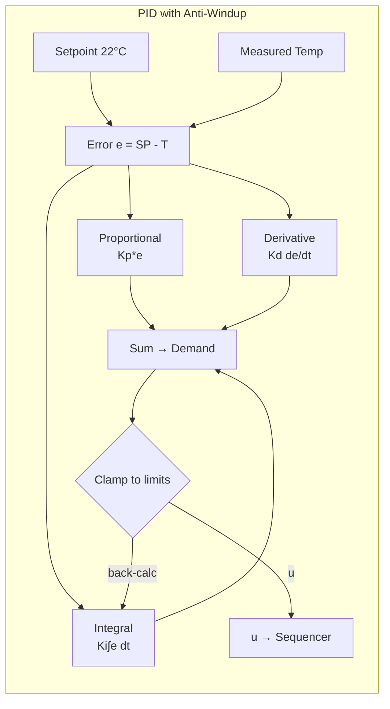
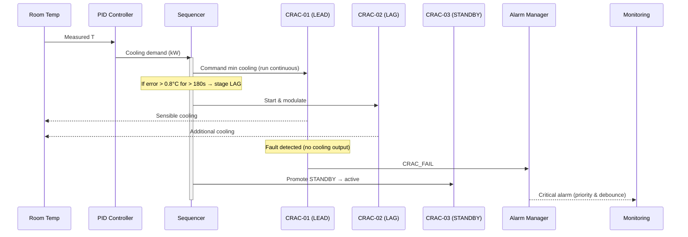
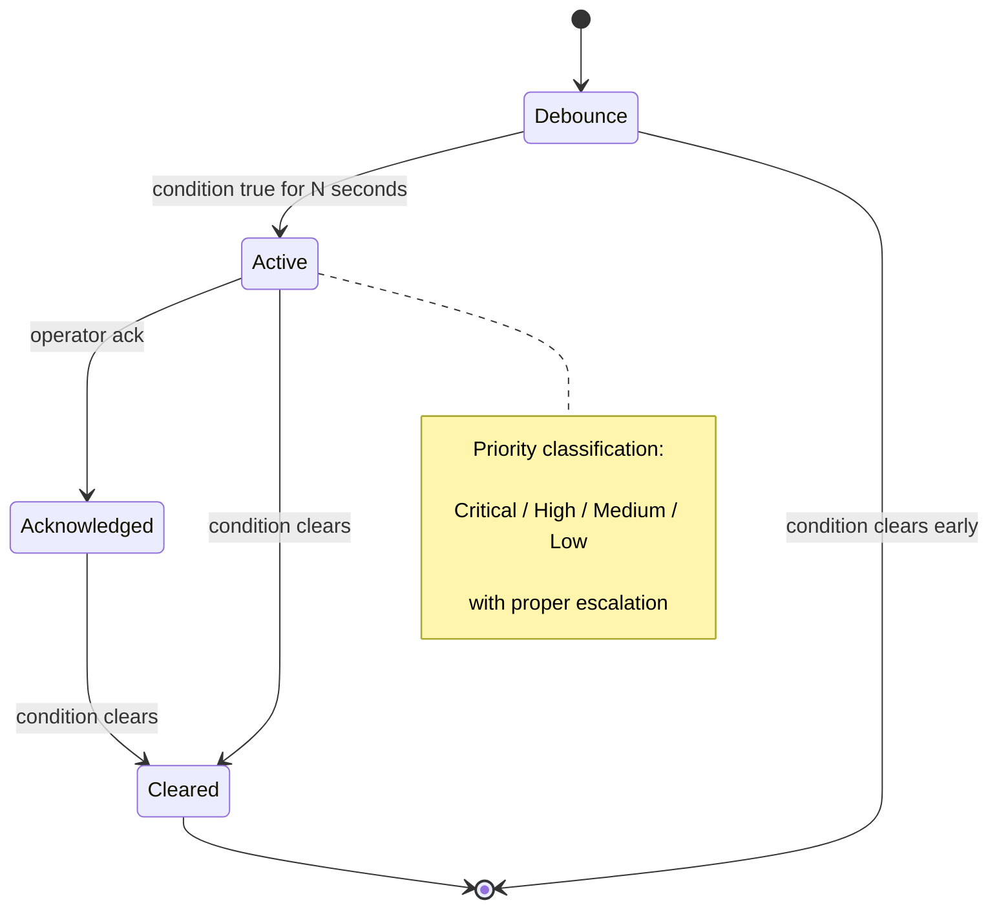

# Control System Details

## PID Control Loop Design



*PID implementation with derivative-on-measurement and conditional integration to prevent windup during saturation conditions.*

## Staging Sequence Logic



*Shows staging thresholds, anti-short-cycle protection, and fault-tolerant role promotion for N+1 redundancy.*

## Alarm Lifecycle State Machine



*Alarm handling with debounce timers to prevent nuisance alarms and state management for operations teams.*

## Control Validation

**Control System Validation**: PID tuning validated against control theory:
- **Step Response**: 4.2 minute settling time (target: <5 minutes)
- **Overshoot**: 0.8°C maximum (target: <1.0°C)  
- **Steady-State Error**: <0.05°C (requirement: <0.1°C)
- **Stability Margin**: >6dB gain margin, >45° phase margin

**Test Execution**:
```bash
# Control loop step testing
python validate_control_response.py --step-size 5.0
```