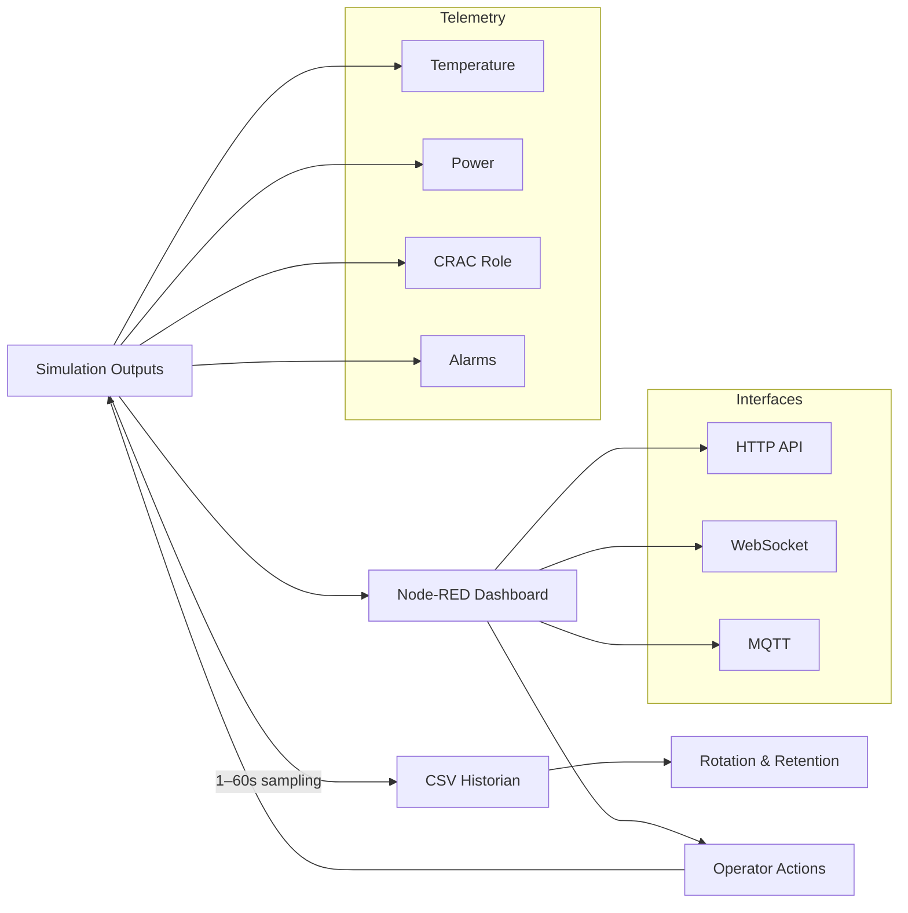

# HMI & Monitoring

## Node-RED Dashboard

### Visual Interface
- Interactive data center floor plan with real-time mimic diagram
- Animated airflow visualization showing cooling distribution patterns
- Color-coded temperature zones with live heat mapping
- Clean header with system status indicators

### Status Monitoring
- Real-time temperature gauge with ASHRAE benchmarking indicators
- CRAC status table with role, command %, cooling output, power, and COP
- Active alarm display with priority-based color coding and duration tracking
- System performance trends with cooling/power efficiency metrics
- Equipment staging indicators showing LAG/STANDBY activation status

### Control Capabilities
- **Temperature Control**: Setpoint adjustment slider (18-26°C)
- **Load Testing**: IT load override for scenario testing (20-100 kW)
- **Role Management**: Individual unit role assignment (LEAD/LAG/STANDBY)
- **Maintenance Mode**: Per-unit maintenance toggles with auto/manual mode switching
- **Fault Injection**: Fault simulation controls

## Interactive Mimic Diagram

### Data Center Floor Layout
- Clear representation of hot/cold aisle configuration
- Server rack positions with visual equipment indicators
- CRAC unit placement showing physical cooling distribution
- Real-time temperature zones with color-coded thermal mapping
- Animated airflow arrows indicating active cooling patterns

### Live Equipment Visualization
- CRAC units change color based on operational status (running/failed/maintenance)
- Temperature zones update in real-time with graduated color scaling
- Airflow animations activate only when units are running
- Equipment labels show role, status, and key performance metrics
- Interactive hover states provide equipment information

## Fault Injection Controls

### Sensor Fault Simulation
- Temperature sensor drift injection
- Sensor bias and calibration errors
- Stuck reading simulation
- Signal noise injection

### Actuator Fault Simulation
- Valve stiction and backlash
- Actuator oscillation patterns
- Performance degradation simulation
- Partial failure scenarios

### Control System Faults
- PID controller instability
- Short-cycling simulation
- Controller saturation/windup
- Communication dropout scenarios

## Role Override & Maintenance Controls

### Individual Unit Management
- Real-time role assignment (LEAD/LAG/STANDBY)
- Maintenance mode activation per unit
- Manual staging override
- Auto/Manual mode switching

### System-Wide Controls
- Global role rotation commands
- Emergency staging overrides
- System-wide maintenance coordination
- Operational mode management

## Telemetry Data Flow

*Data pipeline from simulation to visualization with integration options for external systems and real-time control.*

## Data Logging
- CSV historian with 1-60 second sampling
- Telemetry: temperatures, equipment status, power consumption
- Auto file rotation and cleanup for long-term operation
- Ready format for external analytics tools